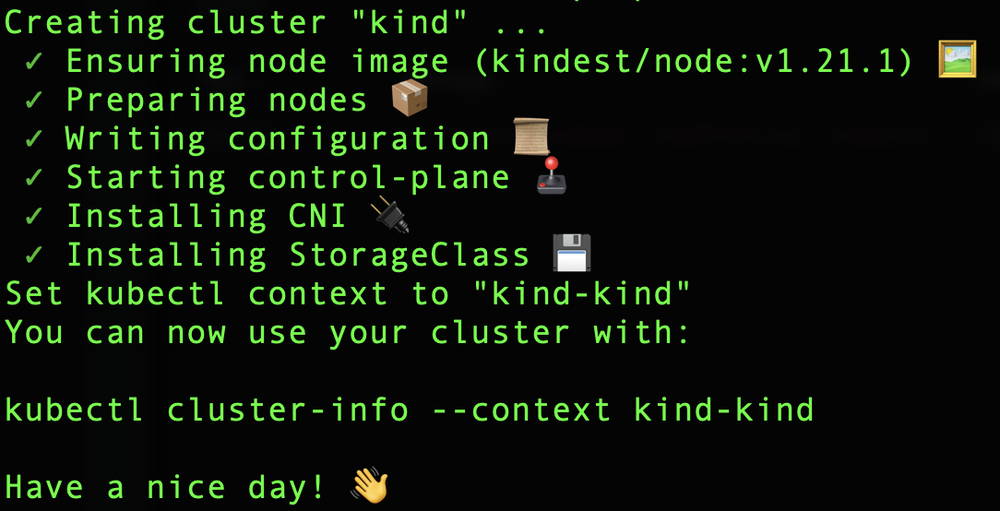

# Chapter:heavy_minus_sign::zero::three: Let's build a Pod

## Create a cluster

```
kind create cluster
```
> Returns

 </img>

```
kubectl config get-contexts
```
> Returns
```
CURRENT   NAME                         CLUSTER                      AUTHINFO                     NAMESPACE
...
*         kind-kind                    kind-kind                    kind-kind                    
```

## Run pod


- [ ] Get onto the control plane container (in a separate window)

* hop on the container

```
docker container exec --interactive --tty kind-control-plane /bin/bash
````

* fetch how many processes before creating pod

```
root@kind-control-plane:/# ps -ax | wc -l
```
> Returns
```
35
```


- [ ] create the pod

```
kubectl create -f pod.yaml
```

* fecth how many processes before creating pod

```
root@kind-control-plane:/# ps -ax | wc -l
```
> Returns
```
38
```

- [ ] Copy `chroot0.sh` to the `kind-control-plane` container

```
CTR_ID=`docker container ls --quiet`; docker container cp chroot0.sh ${CTR_ID}:/home/chroot0.sh
```

### Proper `chroot` Exit

```
umount /home/namespace/box/proc
```
```
umount /home/namespace/box/data
```

:round_pushpin: from INSIDE your running chroot0 script, get its PID, by running

```
root@kind-control-plane:/# echo $$
```
> Returns
```
9580
```

```
root@kind-control-plane:/# 
```
> Run
```
mkdir -p /sys/fs/cgroup/memory/chroot0 \
echo "10" > /sys/fs/cgroup/memory/chroot0/memory.limit_in_bytes \
echo "0" > /sys/fs/cgroup/memory/chroot0/memory.swappiness \
echo 25266 > /sys/fs/cgroup/memory/chroot0/tasks
```

:x: bash: tasks: Permission denied :bangbang:

On Manning's forum

```
James World: I got this working with some changes. It seems, at least in my kind docker container, the paths required are a little different. I did the following:

mkdir -p /sys/fs/cgroup/chroot0
echo "10" > /sys/fs/cgroup/chroot0/memory.max
echo "0" > /sys/fs/cgroup/chroot0/memory.swap.max
echo <proc-id> > /sys/fs/cgroup/chroot0/cgroup.procs
```

## Pods

```
k exec --stdin --tty core-k8s -- ip addr
```
> Outputs
```
1: lo: <LOOPBACK,UP,LOWER_UP> mtu 65536 qdisc noqueue qlen 1000
    link/loopback 00:00:00:00:00:00 brd 00:00:00:00:00:00
    inet 127.0.0.1/8 scope host lo
       valid_lft forever preferred_lft forever
    inet6 ::1/128 scope host 
       valid_lft forever preferred_lft forever
2: tunl0@NONE: <NOARP> mtu 1480 qdisc noop qlen 1000
    link/ipip 0.0.0.0 brd 0.0.0.0
3: ip6tnl0@NONE: <NOARP> mtu 1452 qdisc noop qlen 1000
    link/tunnel6 00:00:00:00:00:00:00:00:00:00:00:00:00:00:00:00 brd 00:00:00:00:00:00:00:00:00:00:00:00:00:00:00:00
4: eth0@if7: <BROADCAST,MULTICAST,UP,LOWER_UP,M-DOWN> mtu 1500 qdisc noqueue 
    link/ether 42:38:c7:cd:d8:d2 brd ff:ff:ff:ff:ff:ff
    inet 10.244.0.5/24 brd 10.244.0.255 scope global eth0
       valid_lft forever preferred_lft forever
    inet6 fe80::4038:c7ff:fecd:d8d2/64 scope link 
       valid_lft forever preferred_lft forever
```

### :three::five::two: Utilizing iptables to understand how kube-proxy implements Kubernetes


```
iptables --append INPUT --source 10.1.2.3 --jump DROP
```

```
iptables-save | grep 10.1.2.3
```
> Outputs
```
-A INPUT -s 10.1.2.3/32 -j DROP
```

```
ip route
```
> Outputs
```
default via 172.18.0.1 dev eth0 
10.244.0.2 dev veth713d72bb scope host 
10.244.0.3 dev veth342465c1 scope host 
10.244.0.4 dev veth3c885152 scope host 
10.244.0.5 dev vethe7d1783d scope host 
172.18.0.0/16 dev eth0 proto kernel scope link src 172.18.0.2 
```

```
iptables-save | grep 10.244.0
```
> Outputs
```
-A KIND-MASQ-AGENT -d 10.244.0.0/16 -m comment --comment "kind-masq-agent: local traffic is not subject to MASQUERADE" -j RETURN
-A KUBE-SEP-6E7XQMQ4RAYOWTTM -s 10.244.0.3/32 -m comment --comment "kube-system/kube-dns:dns" -j KUBE-MARK-MASQ
-A KUBE-SEP-6E7XQMQ4RAYOWTTM -p udp -m comment --comment "kube-system/kube-dns:dns" -m udp -j DNAT --to-destination 10.244.0.3:53
-A KUBE-SEP-IT2ZTR26TO4XFPTO -s 10.244.0.2/32 -m comment --comment "kube-system/kube-dns:dns-tcp" -j KUBE-MARK-MASQ
-A KUBE-SEP-IT2ZTR26TO4XFPTO -p tcp -m comment --comment "kube-system/kube-dns:dns-tcp" -m tcp -j DNAT --to-destination 10.244.0.2:53
-A KUBE-SEP-N4G2XR5TDX7PQE7P -s 10.244.0.2/32 -m comment --comment "kube-system/kube-dns:metrics" -j KUBE-MARK-MASQ
-A KUBE-SEP-N4G2XR5TDX7PQE7P -p tcp -m comment --comment "kube-system/kube-dns:metrics" -m tcp -j DNAT --to-destination 10.244.0.2:9153
-A KUBE-SEP-YIL6JZP7A3QYXJU2 -s 10.244.0.2/32 -m comment --comment "kube-system/kube-dns:dns" -j KUBE-MARK-MASQ
-A KUBE-SEP-YIL6JZP7A3QYXJU2 -p udp -m comment --comment "kube-system/kube-dns:dns" -m udp -j DNAT --to-destination 10.244.0.2:53
-A KUBE-SEP-ZP3FB6NMPNCO4VBJ -s 10.244.0.3/32 -m comment --comment "kube-system/kube-dns:metrics" -j KUBE-MARK-MASQ
-A KUBE-SEP-ZP3FB6NMPNCO4VBJ -p tcp -m comment --comment "kube-system/kube-dns:metrics" -m tcp -j DNAT --to-destination 10.244.0.3:9153
-A KUBE-SEP-ZXMNUKOKXUTL2MK2 -s 10.244.0.3/32 -m comment --comment "kube-system/kube-dns:dns-tcp" -j KUBE-MARK-MASQ
-A KUBE-SEP-ZXMNUKOKXUTL2MK2 -p tcp -m comment --comment "kube-system/kube-dns:dns-tcp" -m tcp -j DNAT --to-destination 10.244.0.3:53
-A KUBE-SVC-ERIFXISQEP7F7OF4 ! -s 10.244.0.0/16 -d 10.96.0.10/32 -p tcp -m comment --comment "kube-system/kube-dns:dns-tcp cluster IP" -m tcp --dport 53 -j KUBE-MARK-MASQ
-A KUBE-SVC-ERIFXISQEP7F7OF4 -m comment --comment "kube-system/kube-dns:dns-tcp -> 10.244.0.2:53" -m statistic --mode random --probability 0.50000000000 -j KUBE-SEP-IT2ZTR26TO4XFPTO
-A KUBE-SVC-ERIFXISQEP7F7OF4 -m comment --comment "kube-system/kube-dns:dns-tcp -> 10.244.0.3:53" -j KUBE-SEP-ZXMNUKOKXUTL2MK2
-A KUBE-SVC-JD5MR3NA4I4DYORP ! -s 10.244.0.0/16 -d 10.96.0.10/32 -p tcp -m comment --comment "kube-system/kube-dns:metrics cluster IP" -m tcp --dport 9153 -j KUBE-MARK-MASQ
-A KUBE-SVC-JD5MR3NA4I4DYORP -m comment --comment "kube-system/kube-dns:metrics -> 10.244.0.2:9153" -m statistic --mode random --probability 0.50000000000 -j KUBE-SEP-N4G2XR5TDX7PQE7P
-A KUBE-SVC-JD5MR3NA4I4DYORP -m comment --comment "kube-system/kube-dns:metrics -> 10.244.0.3:9153" -j KUBE-SEP-ZP3FB6NMPNCO4VBJ
-A KUBE-SVC-NPX46M4PTMTKRN6Y ! -s 10.244.0.0/16 -d 10.96.0.1/32 -p tcp -m comment --comment "default/kubernetes:https cluster IP" -m tcp --dport 443 -j KUBE-MARK-MASQ
-A KUBE-SVC-TCOU7JCQXEZGVUNU ! -s 10.244.0.0/16 -d 10.96.0.10/32 -p udp -m comment --comment "kube-system/kube-dns:dns cluster IP" -m udp --dport 53 -j KUBE-MARK-MASQ
-A KUBE-SVC-TCOU7JCQXEZGVUNU -m comment --comment "kube-system/kube-dns:dns -> 10.244.0.2:53" -m statistic --mode random --probability 0.50000000000 -j KUBE-SEP-YIL6JZP7A3QYXJU2
-A KUBE-SVC-TCOU7JCQXEZGVUNU -m comment --comment "kube-system/kube-dns:dns -> 10.244.0.3:53" -j KUBE-SEP-6E7XQMQ4RAYOWTTM
```


# References

- [ ] [http://mng.bz/8M12](https://github.com/kubernetes/kubernetes/blob/master/pkg/volume/util/subpath/subpath_linux.go#L93)
- [ ] [chroot: failed to run command ‘/bin/bash’: No such file or directory](https://unix.stackexchange.com/questions/128046/chroot-failed-to-run-command-bin-bash-no-such-file-or-directory)
- [ ] [ArchLinux - chroot](https://wiki.archlinux.org/title/chroot)
- [ ] [Control Group v2](https://www.kernel.org/doc/html/v5.10/admin-guide/cgroup-v2.html)
- [ ] [REJECT vs DROP when using iptables](https://serverfault.com/questions/157375/reject-vs-drop-when-using-iptables)
- [ ] [Forum](https://livebook.manning.com/book/core-kubernetes/chapter-3/#:~:text=from%20this%20book%27s-,other,-MEAP%20versions%20by)
