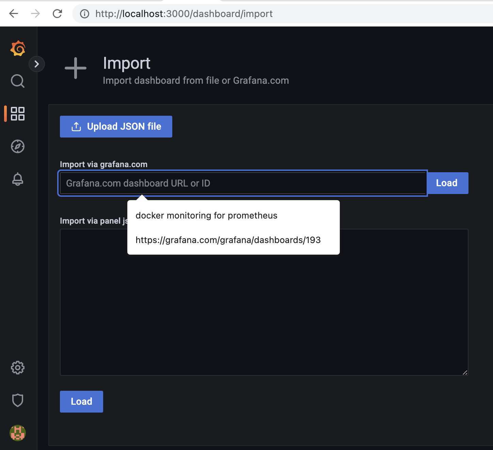
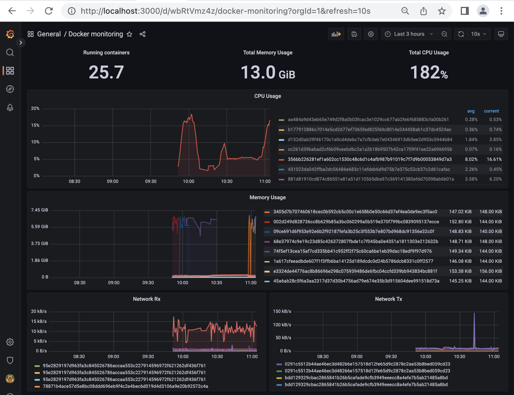
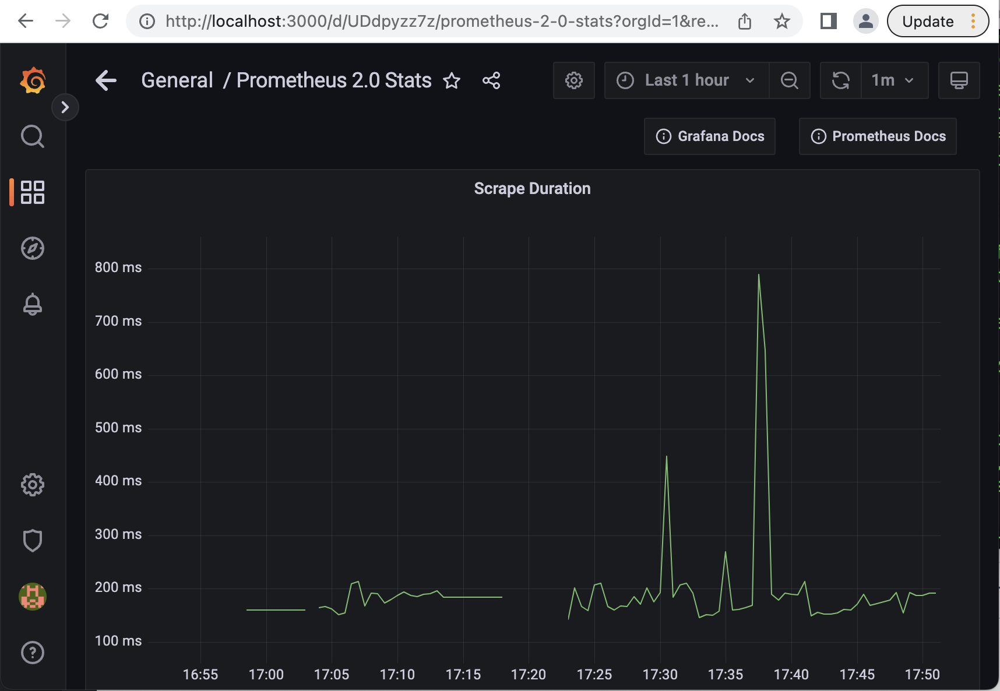

# Chapter :zero::four:

```
docker container exec --interactive --tty kind-control-plane bash
```

## :round_pushpin: 4.2 Processes and threads in Linux

```
ps -ax | grep scheduler
```
> Outputs
```
    434 ?        Ssl    0:52 kube-scheduler --authentication-kubeconfig=/etc/kubernetes/scheduler.conf --authorization-kubeconfig=/etc/kubernetes/scheduler.conf --bind-address=127.0.0.1 --kubeconfig=/etc/kubernetes/scheduler.conf --leader-elect=true --port=0
  51849 pts/1    S+     0:00 grep --color=auto scheduler
```

```
ps --help threads    
```
> Outputs
```
Usage:
 ps [options]

Show threads:
  H                   as if they were processes
 -L                   possibly with LWP and NLWP columns
 -m, m                after processes
 -T                   possibly with SPID column
```

```
ps -T 434
```
> Outputs
```
    PID    SPID TTY      STAT   TIME COMMAND
    434     434 ?        Rsl    0:08 kube-scheduler --authentication-kubeconfig=/etc/kubernetes/scheduler.conf --autho
    434     500 ?        Rsl    0:12 kube-scheduler --authentication-kubeconfig=/etc/kubernetes/scheduler.conf --autho
    434     501 ?        Ssl    0:00 kube-scheduler --authentication-kubeconfig=/etc/kubernetes/scheduler.conf --autho
    434     502 ?        Ssl    0:00 kube-scheduler --authentication-kubeconfig=/etc/kubernetes/scheduler.conf --autho
    434     503 ?        Ssl    0:03 kube-scheduler --authentication-kubeconfig=/etc/kubernetes/scheduler.conf --autho
    434     513 ?        Ssl    0:06 kube-scheduler --authentication-kubeconfig=/etc/kubernetes/scheduler.conf --autho
    434     514 ?        Ssl    0:08 kube-scheduler --authentication-kubeconfig=/etc/kubernetes/scheduler.conf --autho
    434     607 ?        Ssl    0:00 kube-scheduler --authentication-kubeconfig=/etc/kubernetes/scheduler.conf --autho
    434     608 ?        Ssl    0:08 kube-scheduler --authentication-kubeconfig=/etc/kubernetes/scheduler.conf --autho
    434   16504 ?        Rsl    0:05 kube-scheduler --authentication-kubeconfig=/etc/kubernetes/scheduler.conf --autho
```

```
apt-get install psmisc
```

```
pstree --thread-names --compact-not | grep sched
        |-containerd-shim-+-kube-scheduler-+-{kube-scheduler}
        |                 |                |-{kube-scheduler}
        |                 |                |-{kube-scheduler}
        |                 |                |-{kube-scheduler}
        |                 |                |-{kube-scheduler}
        |                 |                |-{kube-scheduler}
        |                 |                |-{kube-scheduler}
        |                 |                |-{kube-scheduler}
        |                 |                `-{kube-scheduler}
```

## :round_pushpin: 4.2.1 systemd and the init process

```
systemctl status
```
> Outputs
```
● kind-control-plane
    State: running
     Jobs: 0 queued
   Failed: 0 units
    Since: Sat 2022-07-16 10:36:33 EAT; 8h ago
   CGroup: /
           ├─init.scope 
           │ ├─    1 /sbin/init
           │ ├─51673 bash
           │ ├─51738 systemctl status
           │ └─51739 (pager)
           ├─system.slice 
           │ ├─containerd.service …
           │ │ ├─ 102 /usr/local/bin/containerd
           │ │ ├─ 278 /usr/local/bin/containerd-shim-runc-v2 -namespace k8s.io -id 2dac3e5ed51b53f3da4c96b655a1d1380265ca4597ad63fd4d8d0faaf53f869d -address /run/containerd/containerd.sock
           │ │ ├─ 279 /usr/local/bin/containerd-shim-runc-v2 -namespace k8s.io -id e9550313a52a4576ccd7c1ac0a76493d729869ff4c60652c5993c2e35f746678 -address /run/containerd/containerd.sock
           │ │ ├─ 280 /usr/local/bin/containerd-shim-runc-v2 -namespace k8s.io -id b3c1257993db12006b3f4232869fb4dfb24db32b534a00ec6e37b2041a9c5796 -address /run/containerd/containerd.sock
           │ │ ├─ 526 /usr/local/bin/containerd-shim-runc-v2 -namespace k8s.io -id 6ad0c6b8b7a7d55d2bdbe9f3d9857a57065be4e569295b8adee3afe93757a052 -address /run/containerd/containerd.sock
           │ │ ├─ 664 /usr/local/bin/containerd-shim-runc-v2 -namespace k8s.io -id 426f1c5b6812a197365867eae2a42e48be4982f82328b778794c4be84842d168 -address /run/containerd/containerd.sock
           │ │ ├─ 770 /usr/local/bin/containerd-shim-runc-v2 -namespace k8s.io -id 696e1fd9a58fa46ddba12a7e002a390e286549e76b7b6dc9381caebf5a55f6af -address /run/containerd/containerd.sock
           │ │ ├─ 829 /usr/local/bin/containerd-shim-runc-v2 -namespace k8s.io -id d7ce4002f230cff6e37267f76ed7369534eb6044392394a69dbb43f4002de16b -address /run/containerd/containerd.sock
           │ │ ├─ 954 /usr/local/bin/containerd-shim-runc-v2 -namespace k8s.io -id 6c1a643f9a1a8f669343590643aaae810c45990fc7f48eea1f5093ce806374b3 -address /run/containerd/containerd.sock
           │ │ └─1112 /usr/local/bin/containerd-shim-runc-v2 -namespace k8s.io -id e028d45f38ed299de7e45e0fa678cd40dbdeecb63b8a9057fc244bda16e1e583 -address /run/containerd/containerd.sock
           │ ├─kubelet.service 
           │ │ └─108 /usr/bin/kubelet --bootstrap-kubeconfig=/etc/kubernetes/bootstrap-kubelet.conf --kubeconfig=/etc/kubernetes/kubelet.conf --config=/var/lib/kubelet/config.yaml --container-runtime=remote --container-runtime-endpoint=unix:///run/containerd/containerd.sock --fail-swap-on=false --node-ip=172.18.0.2 --node-labels= --pod-infra-container-image=k8s.gcr.io/pause:3.4.1 --provider-id=kind://docker/kind/kind-control-plane --fail-swap-on=false --cgroup-root=/kubelet
           │ └─systemd-journald.service 
           │   └─89 /lib/systemd/systemd-journald
           └─kubelet 
             └─kubepods 
               ├─podc3c1764b-d331-4401-bec0-19ad8cdc8656 
               │ ├─1d783b070199eb124e16875c76dda68b524ad86273e2d070224db3c56a960ff9 
               │ │ └─929 /bin/kindnetd
               │ └─696e1fd9a58fa46ddba12a7e002a390e286549e76b7b6dc9381caebf5a55f6af 
               │   └─810 /pause
               ├─burstable 
               │ ├─poda6bcb7e4-2a52-44b0-87bb-77221d153b3e 
               │ │ ├─e028d45f38ed299de7e45e0fa678cd40dbdeecb63b8a9057fc244bda16e1e583 
               │ │ │ └─1137 /pause
               │ │ └─47a2a9e4e5889e7fd7cf0c1abdc9e4c6ca2cb12a1464c98f1cd17c0b19397a35 
               │ │   └─1218 /coredns -conf /etc/coredns/Corefile
               │ ├─pod24ba8551bcc724a32d591bb02c423d92 
               │ │ ├─b3c1257993db12006b3f4232869fb4dfb24db32b534a00ec6e37b2041a9c5796 
               │ │ │ └─348 /pause
               │ │ └─aace7c4baa450cf7b56dacbaa5088b0c3fd616723eb74217bc04f99bab3398aa 
               │ │   └─460 etcd --advertise-client-urls=https://172.18.0.2:2379 --cert-file=/etc/kubernetes/pki/etcd/server.crt --client-cert-auth=true --data-dir=/var/lib/etcd --initial-advertise-peer-urls=https://172.18.0.2:2380 --initial-cluster=kind-control-plane=https://172.18.0.2:2380 --key-file=/etc/kubernetes/pki/etcd/server.key --listen-client-urls=https://127.0.0.1:2379,https://172.18.0.2:2379 --listen-metrics-urls=http://127.0.0.1:2381 --listen-peer-urls=https://172.18.0.2:2380 --name=kind-control-plane --peer-cert-file=/etc/kubernetes/pki/etcd/peer.crt --peer-client-cert-auth=true --peer-key-file=/etc/kubernetes/pki/etcd/peer.key --peer-trusted-ca-file=/etc/kubernetes/pki/etcd/ca.crt --snapshot-count=10000 --trusted-ca-file=/etc/kubernetes/pki/etcd/ca.crt
               │ ├─pod69dd939498054a211c3461b2a9cc8d26 
               │ │ ├─e9550313a52a4576ccd7c1ac0a76493d729869ff4c60652c5993c2e35f746678 
               │ │ │ └─336 /pause
               │ │ └─abf0a53a75b96b2e700f9d6bd9ae72047f103aeed41cd69f4b44e22a5a5993fd 
               │ │   └─434 kube-scheduler --authentication-kubeconfig=/etc/kubernetes/scheduler.conf --authorization-kubeconfig=/etc/kubernetes/scheduler.conf --bind-address=127.0.0.1 --kubeconfig=/etc/kubernetes/scheduler.conf --leader-elect=true --port=0
               │ ├─pod46dac9a538838115821dfd9559149484 
               │ │ ├─972055640bc63f5c4d894145950cf92cdfb524dcf049fbe6aee47bf23facf297 
               │ │ │ └─433 kube-controller-manager --allocate-node-cidrs=true --authentication-kubeconfig=/etc/kubernetes/controller-manager.conf --authorization-kubeconfig=/etc/kubernetes/controller-manager.conf --bind-address=127.0.0.1 --client-ca-file=/etc/kubernetes/pki/ca.crt --cluster-cidr=10.244.0.0/16 --cluster-name=kind --cluster-signing-cert-file=/etc/kubernetes/pki/ca.crt --cluster-signing-key-file=/etc/kubernetes/pki/ca.key --controllers=*,bootstrapsigner,tokencleaner --enable-hostpath-provisioner=true --kubeconfig=/etc/kubernetes/controller-manager.conf --leader-elect=true --port=0 --requestheader-client-ca-file=/etc/kubernetes/pki/front-proxy-ca.crt --root-ca-file=/etc/kubernetes/pki/ca.crt --service-account-private-key-file=/etc/kubernetes/pki/sa.key --service-cluster-ip-range=10.96.0.0/16 --use-service-account-credentials=true
               │ │ └─2dac3e5ed51b53f3da4c96b655a1d1380265ca4597ad63fd4d8d0faaf53f869d 
               │ │   └─334 /pause
               │ ├─podac26526c-e1df-49e9-88e0-12140f9befe0 
               │ │ ├─426f1c5b6812a197365867eae2a42e48be4982f82328b778794c4be84842d168 
               │ │ │ └─684 /pause
               │ │ └─664111be4a97747007a2a614811e9455321a609a69006586920908e75b0ec6be 
               │ │   └─719 /coredns -conf /etc/coredns/Corefile
               │ └─podbd1c21fe1f0ef615e0b5e41299f1be61 
               │   ├─6ad0c6b8b7a7d55d2bdbe9f3d9857a57065be4e569295b8adee3afe93757a052 
               │   │ └─546 /pause
               │   └─155b14e9e8a929f893f0b71895554ab40d1d2c5b4b3b8e1a004cb6cc1ce61c33 
               │     └─579 kube-apiserver --advertise-address=172.18.0.2 --allow-privileged=true --authorization-mode=Node,RBAC --client-ca-file=/etc/kubernetes/pki/ca.crt --enable-admission-plugins=NodeRestriction --enable-bootstrap-token-auth=true --etcd-cafile=/etc/kubernetes/pki/etcd/ca.crt --etcd-certfile=/etc/kubernetes/pki/apiserver-etcd-client.crt --etcd-keyfile=/etc/kubernetes/pki/apiserver-etcd-client.key --etcd-servers=https://127.0.0.1:2379 --insecure-port=0 --kubelet-client-certificate=/etc/kubernetes/pki/apiserver-kubelet-client.crt --kubelet-client-key=/etc/kubernetes/pki/apiserver-kubelet-client.key --kubelet-preferred-address-types=InternalIP,ExternalIP,Hostname --proxy-client-cert-file=/etc/kubernetes/pki/front-proxy-client.crt --proxy-client-key-file=/etc/kubernetes/pki/front-proxy-client.key --requestheader-allowed-names=front-proxy-client --requestheader-client-ca-file=/etc/kubernetes/pki/front-proxy-ca.crt --requestheader-extra-headers-prefix=X-Remote-Extra- --requestheader-group-headers=X-Remote-Group --requestheader-username-headers=X-Remote-User --runtime-config= --secure-port=6443 --service-account-issuer=https://kubernetes.default.svc.cluster.local --service-account-key-file=/etc/kubernetes/pki/sa.pub --service-account-signing-key-file=/etc/kubernetes/pki/sa.key --service-cluster-ip-range=10.96.0.0/16 --tls-cert-file=/etc/kubernetes/pki/apiserver.crt --tls-private-key-file=/etc/kubernetes/pki/apiserver.key
               └─besteffort 
                 ├─podb33999ec-2cb1-4d0e-9733-b4bce21ca7b2 
                 │ ├─688d09db9cbb9ad79ee9c7456c499a93accfc7126760eaa1b98cfcff2c19224d 
                 │ │ └─1531 local-path-provisioner --debug start --helper-image k8s.gcr.io/build-image/debian-base:v2.1.0 --config /etc/config/config.json
                 │ └─d7ce4002f230cff6e37267f76ed7369534eb6044392394a69dbb43f4002de16b 
                 │   └─851 /pause
                 └─pod0ec90011-b5ae-4efc-8a54-d9fc34119605 
                   ├─6c1a643f9a1a8f669343590643aaae810c45990fc7f48eea1f5093ce806374b3 
                   │ └─978 /pause
                   └─f5cfbbf0ab83c29c42f4c1e84f12ca91ef77a2c39ee9b753b48cfbb743958947 
                     └─1011 /usr/local/bin/kube-proxy --config=/var/lib/kube-proxy/config.conf --hostname-override=kind-control-plane
```

## :round_pushpin: 4.2.2 cgroups for our process

```
cat /proc/*/cgroup
```
> Outputs
```
0::/init.scope
0::/kubelet/kubepods/besteffort/pod0ec90011-b5ae-4efc-8a54-d9fc34119605/f5cfbbf0ab83c29c42f4c1e84f12ca91ef77a2c39ee9b753b48cfbb743958947
0::/system.slice/containerd.service
0::/system.slice/kubelet.service
0::/system.slice/containerd.service
0::/kubelet/kubepods/burstable/poda6bcb7e4-2a52-44b0-87bb-77221d153b3e/e028d45f38ed299de7e45e0fa678cd40dbdeecb63b8a9057fc244bda16e1e583
0::/kubelet/kubepods/burstable/poda6bcb7e4-2a52-44b0-87bb-77221d153b3e/47a2a9e4e5889e7fd7cf0c1abdc9e4c6ca2cb12a1464c98f1cd17c0b19397a35
0::/kubelet/kubepods/besteffort/podb33999ec-2cb1-4d0e-9733-b4bce21ca7b2/688d09db9cbb9ad79ee9c7456c499a93accfc7126760eaa1b98cfcff2c19224d
0::/system.slice/containerd.service
0::/system.slice/containerd.service
0::/system.slice/containerd.service
0::/kubelet/kubepods/burstable/pod46dac9a538838115821dfd9559149484/2dac3e5ed51b53f3da4c96b655a1d1380265ca4597ad63fd4d8d0faaf53f869d
0::/kubelet/kubepods/burstable/pod69dd939498054a211c3461b2a9cc8d26/e9550313a52a4576ccd7c1ac0a76493d729869ff4c60652c5993c2e35f746678
0::/kubelet/kubepods/burstable/pod24ba8551bcc724a32d591bb02c423d92/b3c1257993db12006b3f4232869fb4dfb24db32b534a00ec6e37b2041a9c5796
0::/kubelet/kubepods/burstable/pod46dac9a538838115821dfd9559149484/972055640bc63f5c4d894145950cf92cdfb524dcf049fbe6aee47bf23facf297
0::/kubelet/kubepods/burstable/pod69dd939498054a211c3461b2a9cc8d26/abf0a53a75b96b2e700f9d6bd9ae72047f103aeed41cd69f4b44e22a5a5993fd
0::/kubelet/kubepods/burstable/pod24ba8551bcc724a32d591bb02c423d92/aace7c4baa450cf7b56dacbaa5088b0c3fd616723eb74217bc04f99bab3398aa
0::/init.scope
0::/system.slice/containerd.service
0::/kubelet/kubepods/burstable/podbd1c21fe1f0ef615e0b5e41299f1be61/6ad0c6b8b7a7d55d2bdbe9f3d9857a57065be4e569295b8adee3afe93757a052
0::/kubelet/kubepods/burstable/podbd1c21fe1f0ef615e0b5e41299f1be61/155b14e9e8a929f893f0b71895554ab40d1d2c5b4b3b8e1a004cb6cc1ce61c33
0::/system.slice/containerd.service
0::/kubelet/kubepods/burstable/podac26526c-e1df-49e9-88e0-12140f9befe0/426f1c5b6812a197365867eae2a42e48be4982f82328b778794c4be84842d168
0::/kubelet/kubepods/burstable/podac26526c-e1df-49e9-88e0-12140f9befe0/664111be4a97747007a2a614811e9455321a609a69006586920908e75b0ec6be
0::/system.slice/containerd.service
0::/kubelet/kubepods/podc3c1764b-d331-4401-bec0-19ad8cdc8656/696e1fd9a58fa46ddba12a7e002a390e286549e76b7b6dc9381caebf5a55f6af
0::/system.slice/containerd.service
0::/kubelet/kubepods/besteffort/podb33999ec-2cb1-4d0e-9733-b4bce21ca7b2/d7ce4002f230cff6e37267f76ed7369534eb6044392394a69dbb43f4002de16b
0::/system.slice/systemd-journald.service
0::/kubelet/kubepods/podc3c1764b-d331-4401-bec0-19ad8cdc8656/1d783b070199eb124e16875c76dda68b524ad86273e2d070224db3c56a960ff9
0::/system.slice/containerd.service
0::/kubelet/kubepods/besteffort/pod0ec90011-b5ae-4efc-8a54-d9fc34119605/6c1a643f9a1a8f669343590643aaae810c45990fc7f48eea1f5093ce806374b3
0::/init.scope
0::/init.scope
```

## :round_pushpin: Testing the cgroups

- [ ] Create the pod with resources

```
kubectl create -f pod.yaml
```

- [ ] hop onto the pod

```
kubectl exec --stdin --tty core-k8s -- /bin/sh
```

- [ ] create the killer command

```
dd if=/dev/zero of=/dev/null
```

- [ ] :desktop_computer: On a separate window open the kind control plane 

```
docker container exec --interactive --tty kind-control-plane /bin/bash
```

- [ ] run top command

```
top
```
> Outputs
```
top - 20:11:59 up  3:25,  0 users,  load average: 0.88, 0.43, 0.29
Tasks:  38 total,   2 running,  36 sleeping,   0 stopped,   0 zombie
%Cpu(s): 15.6 us, 12.2 sy,  0.1 ni, 71.9 id,  0.1 wa,  0.0 hi,  0.2 si,  0.0 st
MiB Mem :   7951.3 total,   4812.9 free,   1262.6 used,   1875.9 buff/cache
MiB Swap:   1024.0 total,   1024.0 free,      0.0 used.   6183.0 avail Mem 

    PID USER      PR  NI    VIRT    RES    SHR S  %CPU  %MEM     TIME+ COMMAND                                       
  69701 root      20   0    1376      4      0 R  99.7   0.0   1:31.09 dd  
```

- [ ] Edit the [`pod.yaml`](pod.yaml) file and reduce the limits

Rerun `top` and observe the `%CPU` column limited to `10.0%`

```
top
```
> Outputs
```
top - 20:29:12 up  3:41,  0 users,  load average: 0.48, 0.88, 0.77
Tasks:  38 total,   2 running,  36 sleeping,   0 stopped,   0 zombie
%Cpu(s):  2.6 us,  2.0 sy,  0.0 ni, 95.4 id,  0.0 wa,  0.0 hi,  0.0 si,  0.0 st
MiB Mem :   7951.3 total,   4810.8 free,   1260.2 used,   1880.3 buff/cache
MiB Swap:   1024.0 total,   1024.0 free,      0.0 used.   6185.4 avail Mem 

    PID USER      PR  NI    VIRT    RES    SHR S  %CPU  %MEM     TIME+ COMMAND                                       
  76195 root      20   0    1376      4      0 R  10.0   0.0   0:02.25 dd 
```

## 4.4 How kubelet manages cgroups

Various quantifiable resources:

- [ ] On `AWS` worker plane

```
ls -d /sys/fs/cgroup/*
```
> Outputs
```
/sys/fs/cgroup/blkio        /sys/fs/cgroup/cpuacct  /sys/fs/cgroup/freezer  /sys/fs/cgroup/misc              /sys/fs/cgroup/net_prio    /sys/fs/cgroup/rdma
/sys/fs/cgroup/cpu          /sys/fs/cgroup/cpuset   /sys/fs/cgroup/hugetlb  /sys/fs/cgroup/net_cls           /sys/fs/cgroup/perf_event  /sys/fs/cgroup/systemd
/sys/fs/cgroup/cpu,cpuacct  /sys/fs/cgroup/devices  /sys/fs/cgroup/memory   /sys/fs/cgroup/net_cls,net_prio  /sys/fs/cgroup/pids        /sys/fs/cgroup/unified
```

- [ ] On `kind` control plane

```
ls -d /sys/fs/cgroup/*
```
> Outputs
```
/sys/fs/cgroup/cgroup.controllers         /sys/fs/cgroup/hugetlb.32MB.rsvd.current
/sys/fs/cgroup/cgroup.events              /sys/fs/cgroup/hugetlb.32MB.rsvd.max
/sys/fs/cgroup/cgroup.freeze              /sys/fs/cgroup/hugetlb.64KB.current
/sys/fs/cgroup/cgroup.max.depth           /sys/fs/cgroup/hugetlb.64KB.events
/sys/fs/cgroup/cgroup.max.descendants     /sys/fs/cgroup/hugetlb.64KB.events.local
/sys/fs/cgroup/cgroup.procs               /sys/fs/cgroup/hugetlb.64KB.max
/sys/fs/cgroup/cgroup.stat                /sys/fs/cgroup/hugetlb.64KB.rsvd.current
/sys/fs/cgroup/cgroup.subtree_control     /sys/fs/cgroup/hugetlb.64KB.rsvd.max
/sys/fs/cgroup/cgroup.threads             /sys/fs/cgroup/init.scope
/sys/fs/cgroup/cgroup.type                /sys/fs/cgroup/io.bfq.weight
/sys/fs/cgroup/cpu.max                    /sys/fs/cgroup/io.max
/sys/fs/cgroup/cpu.stat                   /sys/fs/cgroup/io.stat
/sys/fs/cgroup/cpu.weight                 /sys/fs/cgroup/kubelet
/sys/fs/cgroup/cpu.weight.nice            /sys/fs/cgroup/memory.current
/sys/fs/cgroup/cpuset.cpus                /sys/fs/cgroup/memory.events
/sys/fs/cgroup/cpuset.cpus.effective      /sys/fs/cgroup/memory.events.local
/sys/fs/cgroup/cpuset.cpus.partition      /sys/fs/cgroup/memory.high
/sys/fs/cgroup/cpuset.mems                /sys/fs/cgroup/memory.low
/sys/fs/cgroup/cpuset.mems.effective      /sys/fs/cgroup/memory.max
/sys/fs/cgroup/dev-hugepages.mount        /sys/fs/cgroup/memory.min
/sys/fs/cgroup/hugetlb.1GB.current        /sys/fs/cgroup/memory.oom.group
/sys/fs/cgroup/hugetlb.1GB.events         /sys/fs/cgroup/memory.stat
/sys/fs/cgroup/hugetlb.1GB.events.local   /sys/fs/cgroup/memory.swap.current
/sys/fs/cgroup/hugetlb.1GB.max            /sys/fs/cgroup/memory.swap.events
/sys/fs/cgroup/hugetlb.1GB.rsvd.current   /sys/fs/cgroup/memory.swap.high
/sys/fs/cgroup/hugetlb.1GB.rsvd.max       /sys/fs/cgroup/memory.swap.max
/sys/fs/cgroup/hugetlb.2MB.current        /sys/fs/cgroup/pids.current
/sys/fs/cgroup/hugetlb.2MB.events         /sys/fs/cgroup/pids.events
/sys/fs/cgroup/hugetlb.2MB.events.local   /sys/fs/cgroup/pids.max
/sys/fs/cgroup/hugetlb.2MB.max            /sys/fs/cgroup/rdma.current
/sys/fs/cgroup/hugetlb.2MB.rsvd.current   /sys/fs/cgroup/rdma.max
/sys/fs/cgroup/hugetlb.2MB.rsvd.max       /sys/fs/cgroup/sys-fs-fuse-connections.mount
/sys/fs/cgroup/hugetlb.32MB.current       /sys/fs/cgroup/sys-kernel-debug.mount
/sys/fs/cgroup/hugetlb.32MB.events        /sys/fs/cgroup/sys-kernel-tracing.mount
/sys/fs/cgroup/hugetlb.32MB.events.local  /sys/fs/cgroup/system.slice
/sys/fs/cgroup/hugetlb.32MB.max
```

## 4.5 Diving into how the kubelet manages resources

- [ ] On a `kops` `AWS` cluster 

```
kubectl get node ip-172-20-12-30.ca-central-1.compute.internal  --output json | jq '.status.allocatable'
```
> Ouputs
```json
{
  "cpu": "8",
  "ephemeral-storage": "119850334420",
  "hugepages-1Gi": "0",
  "hugepages-2Mi": "0",
  "memory": "32500116Ki",
  "pods": "110"
}
```

- [ ] On a `kind` cluster

```
kubectl get node kind-control-plane --output json | jq '.status.allocatable'
```
> Ouputs
```json
{
  "cpu": "4",
  "ephemeral-storage": "61255492Ki",
  "hugepages-1Gi": "0",
  "hugepages-2Mi": "0",
  "hugepages-32Mi": "0",
  "hugepages-64Ki": "0",
  "memory": "8142120Ki",
  "pods": "110"
}
```

## 4.5.5 Creating QoS classes by setting resources

```
k create ns qos; k -n qos run --image=nginx myapp
```
> Outputs
```
namespace/qos created
pod/myapp created
```

```
k get pods myapp -n qos -o yaml
```
> Outputs
```yaml
apiVersion: v1
kind: Pod
metadata:
  creationTimestamp: "2022-07-26T11:29:09Z"
  labels:
    run: myapp
  name: myapp
  namespace: qos
  resourceVersion: "37870734"
  uid: c1b50d8e-9418-41ba-a4f6-a407ec07b125
spec:
  containers:
  - image: nginx
    imagePullPolicy: Always
    name: myapp
    resources: {}
    terminationMessagePath: /dev/termination-log
    terminationMessagePolicy: File
    volumeMounts:
    - mountPath: /var/run/secrets/kubernetes.io/serviceaccount
      name: kube-api-access-qhqqh
      readOnly: true
  dnsPolicy: ClusterFirst
  enableServiceLinks: true
  nodeName: ip-172-20-54-172.ca-central-1.compute.internal
  preemptionPolicy: PreemptLowerPriority
  priority: 0
  restartPolicy: Always
  schedulerName: default-scheduler
  securityContext: {}
  serviceAccount: default
  serviceAccountName: default
  terminationGracePeriodSeconds: 30
  tolerations:
  - effect: NoExecute
    key: node.kubernetes.io/not-ready
    operator: Exists
    tolerationSeconds: 300
  - effect: NoExecute
    key: node.kubernetes.io/unreachable
    operator: Exists
    tolerationSeconds: 300
  volumes:
  - name: kube-api-access-qhqqh
    projected:
      defaultMode: 420
      sources:
      - serviceAccountToken:
          expirationSeconds: 3607
          path: token
      - configMap:
          items:
          - key: ca.crt
            path: ca.crt
          name: kube-root-ca.crt
      - downwardAPI:
          items:
          - fieldRef:
              apiVersion: v1
              fieldPath: metadata.namespace
            path: namespace
status:
  conditions:
  - lastProbeTime: null
    lastTransitionTime: "2022-07-26T11:29:09Z"
    status: "True"
    type: Initialized
  - lastProbeTime: null
    lastTransitionTime: "2022-07-26T11:29:14Z"
    status: "True"
    type: Ready
  - lastProbeTime: null
    lastTransitionTime: "2022-07-26T11:29:14Z"
    status: "True"
    type: ContainersReady
  - lastProbeTime: null
    lastTransitionTime: "2022-07-26T11:29:09Z"
    status: "True"
    type: PodScheduled
  containerStatuses:
  - containerID: containerd://6f0f73d9a7a3d426ba1ff0de4249186ccbadc96dbe428a3038374da6a7323429
    image: docker.io/library/nginx:latest
    imageID: docker.io/library/nginx@sha256:1761fb5661e4d77e107427d8012ad3a5955007d997e0f4a3d41acc9ff20467c7
    lastState: {}
    name: myapp
    ready: true
    restartCount: 0
    started: true
    state:
      running:
        startedAt: "2022-07-26T11:29:14Z"
  hostIP: 172.20.54.172
  phase: Running
  podIP: 100.96.2.122
  podIPs:
  - ip: 100.96.2.122
  qosClass: BestEffort
  startTime: "2022-07-26T11:29:09Z"
```

:x: Didn't wotk can't edit!

```
k delete ns qos
```
> Outputs
```
namespace "qos" deleted
```


## 4.6.2 Why do I need Prometheus?

```
k proxy                                       
```
> Outputs
```
Starting to serve on 127.0.0.1:8001
```

In another window, run:

```
curl localhost:8001/metrics | grep etcd | grep core.Pod | grep get | grep \*core.Pod
```
> Outputs
```
  % Total    % Received % Xferd  Average Speed   Time    Time     Time  Current
                                 Dload  Upload   Total   Spent    Left  Speed
100 6455k    0 6455k    0     0  15.2M      0 --:--:-- --:--:-- --:--:-- 15.3M
etcd_request_duration_seconds_bucket{operation="get",type="*core.Pod",le="0.005"} 141825
etcd_request_duration_seconds_bucket{operation="get",type="*core.Pod",le="0.025"} 144879
etcd_request_duration_seconds_bucket{operation="get",type="*core.Pod",le="0.1"} 144898
etcd_request_duration_seconds_bucket{operation="get",type="*core.Pod",le="0.25"} 144898
etcd_request_duration_seconds_bucket{operation="get",type="*core.Pod",le="0.5"} 144899
etcd_request_duration_seconds_bucket{operation="get",type="*core.Pod",le="1"} 144899
etcd_request_duration_seconds_bucket{operation="get",type="*core.Pod",le="2"} 144899
etcd_request_duration_seconds_bucket{operation="get",type="*core.Pod",le="4"} 144899
etcd_request_duration_seconds_bucket{operation="get",type="*core.Pod",le="15"} 144901
etcd_request_duration_seconds_bucket{operation="get",type="*core.Pod",le="30"} 144901
etcd_request_duration_seconds_bucket{operation="get",type="*core.Pod",le="60"} 144901
etcd_request_duration_seconds_bucket{operation="get",type="*core.Pod",le="+Inf"} 144901
etcd_request_duration_seconds_sum{operation="get",type="*core.Pod"} 220.68180331800176
etcd_request_duration_seconds_count{operation="get",type="*core.Pod"} 144901
```

:exclamation_mark: The majority of the requests are under le="0.025"

## 4.6.3 Creating a local Prometheus monitoring service

```
prometheus --storage.tsdb.path=./data --config.file=./prometheus.yaml
```
> Outputs
```
ts=2022-07-26T13:19:57.325Z caller=main.go:491 level=info msg="No time or size retention was set so using the default time retention" duration=15d
ts=2022-07-26T13:19:57.325Z caller=main.go:535 level=info msg="Starting Prometheus Server" mode=server version="(version=2.37.0, branch=non-git, revision=non-git)"
ts=2022-07-26T13:19:57.325Z caller=main.go:540 level=info build_context="(go=go1.18.4, user=brew@HMBRW-A-001-M1-004.local, date=20220714-23:33:56)"
ts=2022-07-26T13:19:57.325Z caller=main.go:541 level=info host_details=(darwin)
ts=2022-07-26T13:19:57.325Z caller=main.go:542 level=info fd_limits="(soft=2560, hard=unlimited)"
ts=2022-07-26T13:19:57.325Z caller=main.go:543 level=info vm_limits="(soft=unlimited, hard=unlimited)"
ts=2022-07-26T13:19:57.329Z caller=web.go:553 level=info component=web msg="Start listening for connections" address=0.0.0.0:9090
ts=2022-07-26T13:19:57.330Z caller=main.go:972 level=info msg="Starting TSDB ..."
ts=2022-07-26T13:19:57.330Z caller=tls_config.go:195 level=info component=web msg="TLS is disabled." http2=false
ts=2022-07-26T13:19:57.333Z caller=head.go:493 level=info component=tsdb msg="Replaying on-disk memory mappable chunks if any"
ts=2022-07-26T13:19:57.333Z caller=head.go:536 level=info component=tsdb msg="On-disk memory mappable chunks replay completed" duration=181.25µs
ts=2022-07-26T13:19:57.333Z caller=head.go:542 level=info component=tsdb msg="Replaying WAL, this may take a while"
ts=2022-07-26T13:19:57.334Z caller=head.go:613 level=info component=tsdb msg="WAL segment loaded" segment=0 maxSegment=0
ts=2022-07-26T13:19:57.334Z caller=head.go:619 level=info component=tsdb msg="WAL replay completed" checkpoint_replay_duration=183.042µs wal_replay_duration=360.208µs total_replay_duration=734.834µs
ts=2022-07-26T13:19:57.334Z caller=main.go:993 level=info fs_type=1a
ts=2022-07-26T13:19:57.334Z caller=main.go:996 level=info msg="TSDB started"
ts=2022-07-26T13:19:57.334Z caller=main.go:1177 level=info msg="Loading configuration file" filename=./prometheus.yaml
ts=2022-07-26T13:19:57.497Z caller=main.go:1214 level=info msg="Completed loading of configuration file" filename=./prometheus.yaml totalDuration=163.124792ms db_storage=417ns remote_storage=834ns web_handler=125ns query_engine=542ns scrape=162.11925ms scrape_sd=72.583µs notify=3.167µs notify_sd=2.292µs rules=2.25µs tracing=464.333µs
ts=2022-07-26T13:19:57.497Z caller=main.go:957 level=info msg="Server is ready to receive web requests."
ts=2022-07-26T13:19:57.498Z caller=manager.go:941 level=info component="rule manager" msg="Starting rule manager..."
```

```
kubectl apply -f https://raw.githubusercontent.com/giantswarm/kube-stresscheck/master/examples/node.yaml
```






# References

- [ ] [cgroup-v1/cgroups.txt](https://www.kernel.org/doc/Documentation/cgroup-v1/cgroups.txt)
- [ ] [cgroup-v1/cpusets.txt](https://www.kernel.org/doc/Documentation/cgroup-v1/cpusets.txt)
- [ ] [Configuring a cgroup driver](https://kubernetes.io/docs/tasks/administer-cluster/reserve-compute-resources/#kube-reserved)
- [ ] [Docker Monitoring with cAdvisor, Prometheus and Grafana](https://medium.com/@mertcan.simsek276/docker-monitoring-with-cadvisor-prometheus-and-grafana-adefe1202bf8)
- [ ] [Dashboard - Cadvisor exporter by kokorinav](https://grafana.com/grafana/dashboards/14282)
- [ ] [cAdvisor - Analyzes resource usage and performance characteristics of running containers.](https://github.com/google/cadvisor)
