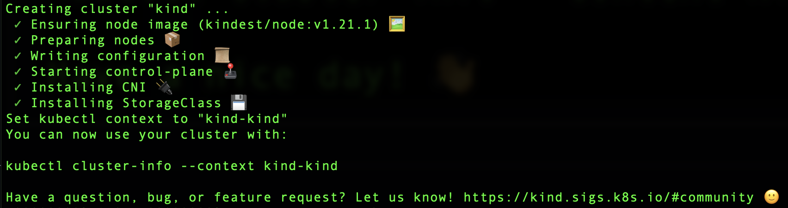

# Install

## :toolbox: Install Tools

* Install `Docker Desktop`

```
ARCH=amd64 # ARCH=arm64
```

```
wget https://desktop.docker.com/mac/main/${ARCH}/Docker.dmg
```

```
hdiutil attach Docker.dmg
```

```
cp -R /Volumes/Docker/Docker.app /Applications
```

```
hdiutil detach /Volumes/Docker
```

* Install `kubectl`
```
brew install kubectl
```

* Install `kind`

```
brew install kind
```

## Install Cluster

```
kind delete cluster --name=kind
```

```
kind create cluster
```
> Returns

 </img>

```
kubectl get nodes
```
> Returns
```
NAME                 STATUS   ROLES                  AGE   VERSION
kind-control-plane   Ready    control-plane,master   11m   v1.21.1
```

```
docker container ls
```
> Returns
```
CONTAINER ID   IMAGE                  COMMAND                  CREATED          STATUS          PORTS                       NAMES
293eb65422ff   kindest/node:v1.21.1   "/usr/local/bin/entr…"   11 minutes ago   Up 11 minutes   127.0.0.1:49424->6443/tcp   kind-control-plane
```

- [ ] Accessing the kind contol plane

```
docker container exec --interactive --tty kind-control-plane /bin/bash
```
